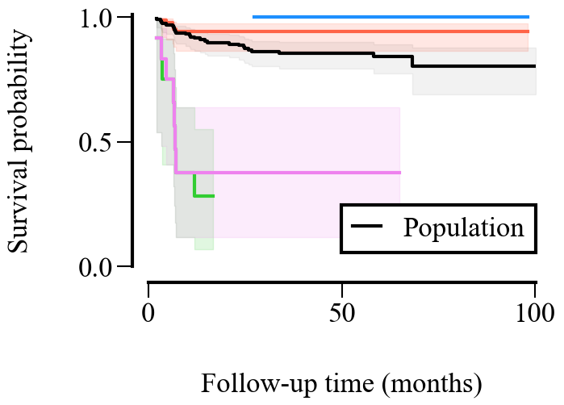

# Learning and Naming Subgroups with Exceptional Survival Characteristics

This is the Python implementation of the paper [<u>Learning and Naming Subgroups with Exceptional Survival Characteristics</u>](https://arxiv.org/abs/2602.22179). We additionally provide a demo in a Jupyter notebook to provide an easy starting point. 

## Required packages

- ```pytorch``` *for learning.*
- ```scikit-survival``` *for survival analysis.*
- ```matplotlib``` *for plotting.*
- ```tqdm``` *for progress bars.*
- ```ipykernel``` *for Jupyter notebooks.*

You can use the Mamba environment manager to install the required packages like so

```
    mamba env create -f environment.yml
    mamba activate sysurv
```

## Folder organization

- `data` contains the dataset used for the case study in the paper and the demo.
- `src` contains the source code of Sysurv.

## Usage

In the Jupyter notebook ```Demo.ipynb```, we show how to use Sysurv. As an example, we use the case study dataset provided in ```data/case_study/``` and replicate the plot below. The parameters for Sysurv can be set using the ```SysurvConfig``` class. To ease the readability, the majority of the code is implemented in ```src/```.

<p align=center >
    
</p>

## Citation

If you find our work useful for your research, please consider citing


```
@misc{alrahwanji:2026:sysurv,
    title={Learning and Naming Subgroups with Exceptional Survival Characteristics}, 
    author={Al Rahwanji, Mhd Jawad and Xu, Sascha and Walter, Nils Philipp and Vreeken, Jilles},
    year={2026},
    eprint={2602.22179},
    archivePrefix={arXiv},
    primaryClass={cs.LG},
    url={https://arxiv.org/abs/2602.22179}, 
}
```

## License

This work is licensed under  [**CC BY 4.0**](https://creativecommons.org/licenses/by/4.0/?ref=chooser-v1).